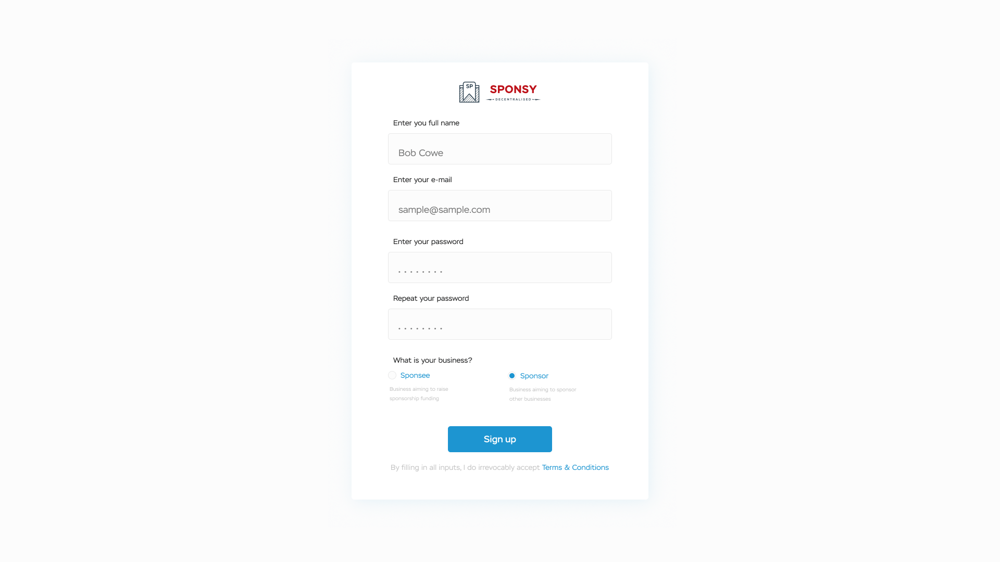
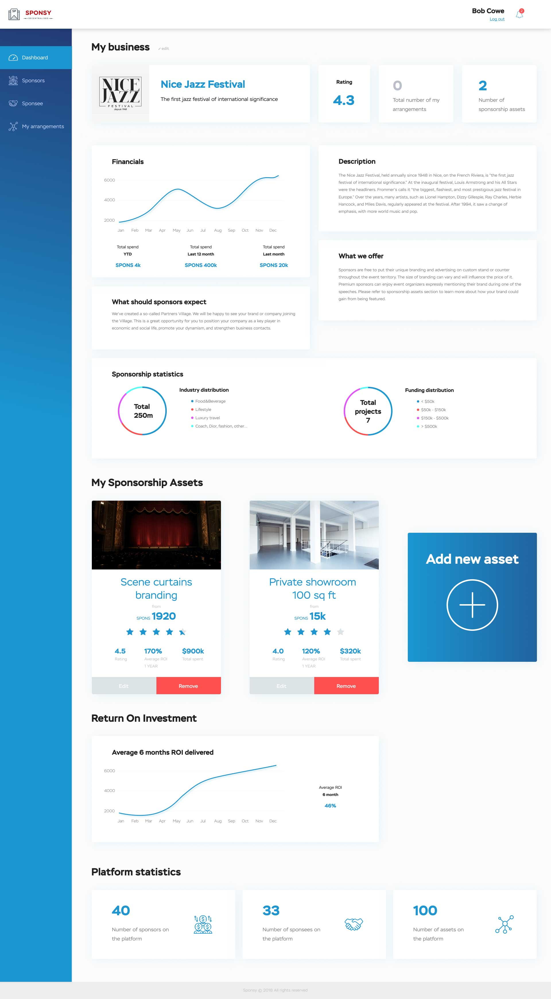
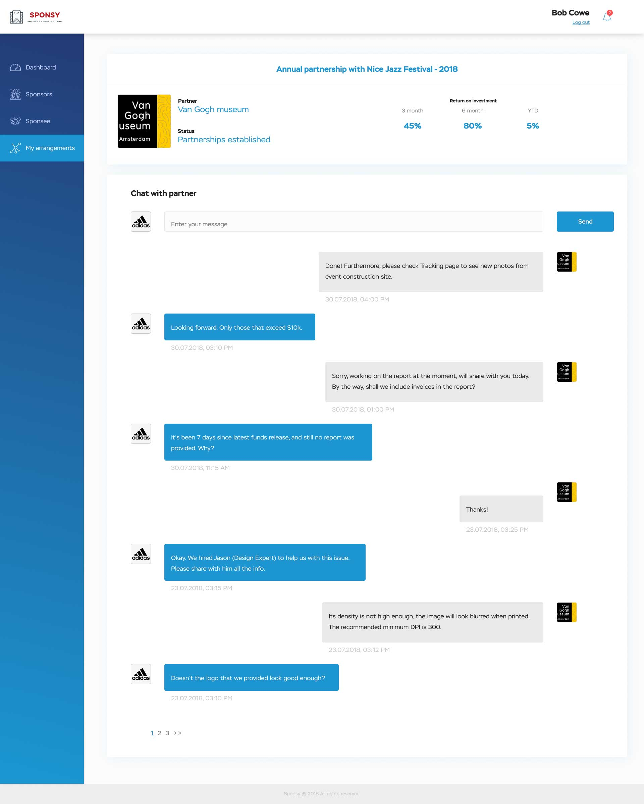

## Sponsy Frontend
# Overview
Sponsy is disrupting the industry of sponsorships by introducing the platform connecting sponsors, sponsees and experts from all over the world. Every business that is willing to be sponsored will be free to sign up, submit the details of his business, list her sponsorship assets and negotiate deals with hundreds of sponsors.

<a href="https://mvp.sponsy.org">Check out our MVP</a>

# Functionality
* Sign up as a <i>sponsor</i> or <i>sponsee</i>
* List your business
    * Specify the title and the brief quote describing your business
    * Upload the logo of your business
    * Create a thorough description of your company
    * Tell about the advantages of running sponsorships with you
    * Choose the industries that you are most comfortable and productive in working with
* List your sponsorship assets (<i>for sponsees only</i>)
    * Specify the title of your sponsorship asset, upload the photo
    * Enter the minimum cost at which you will be willing to sell the asset
* Discover sponsorship statistics pertaining to sponsors and sponsees of your interest
    * See the financials of each business
    * Instantly analyze Industries and Geo distributions of partners of each business
    * Explore the Return on Investment of sponsees
* Discover new sponsors and sponsees
    * Reach out to any business of your choice
    * Send partnership proposals to businesses you like and see whether they like you back
    * Communicate with partner and create an exceptional sponsorship experience

# Visual

# To-do
- [ ] Experts registration and collaboration
- [ ] Inner freelancers platform
- [ ] IoT integration
